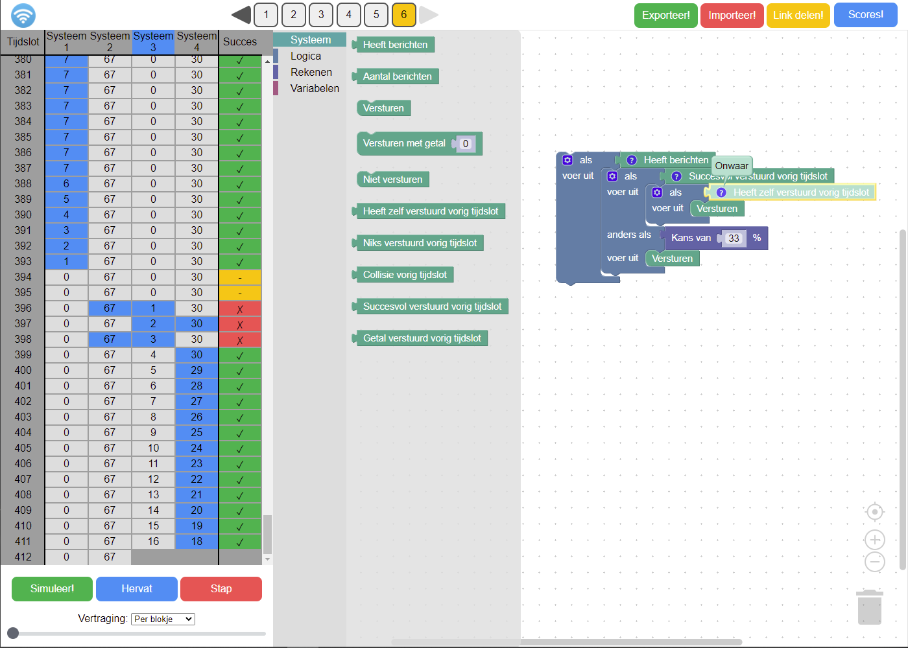

# MAC Protocol Challenge
Simulate Channel Access Methods and achieve the highest score!

This project has been developed as part of a computer science education research.
It has been used in a pilot with Dutch high-school classes.

- Title: Lessenserie voor Medium Access Control protocollen
- Author: Sven Konings
- Year: 2021
- URL: [essay.utwente.nl/88215](https://essay.utwente.nl/88215/)

## Paper abstract (Dutch)
Dit is een ontwerponderzoek over een lessenserie binnen het Keuzedomein L: Netwerken van het 2019 examenprogramma informatica.
Het doel van dit onderzoek is om een enthousiasmerende en effectieve lessenserie te ontwerpen die gebruik maakt van een werkvorm waarin leerlingen zelf simulaties kunnen draaien en proberen een zo hoog mogelijke score te behalen.
De lessenserie gaat over Medium Access Control-protocollen en maakt gebruik van een omgeving waarin leerlingen deze protocollen kunnen simuleren.
De lessenserie begint met theorie aan de hand van een spel en vervolgens kunnen leerlingen in tweetallen protocollen simuleren en proberen de scores van andere groepen te overtreffen.
Het resulterende lesmateriaal vormt een veelbelovende basis, maar er moet meer tijd genomen worden om alle stof te behandelen en er moet meer sturing binnen de lessenserie worden aangebracht.

## Additional resources (Dutch)
- Uitleg van de omgeving: [Uitleg challenge.pdf](https://nbviewer.org/github/svenkonings/MAC-Protocol-Challenge/blob/master/resources/pdf/Uitleg%20challenge.pdf)
- Handreiking lessenserie: [Handreiking.pdf](https://nbviewer.org/github/svenkonings/MAC-Protocol-Challenge/blob/master/resources/pdf/Handreiking.pdf)
